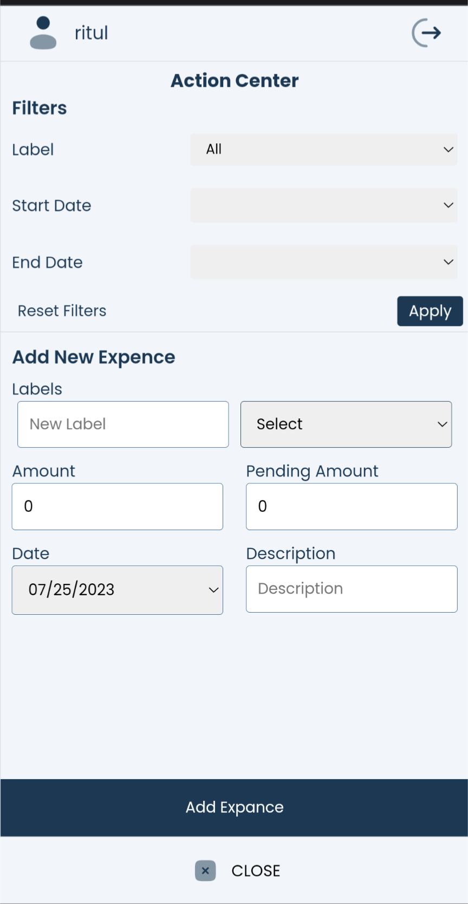

# [Whatspent](https://whatspent.daryanritul.in)

<p align="center">
  
</p>

 [Whatspent]((https://whatspent.daryanritul.in)) Website Link
 
## Introduction

Whatspent is a web application built to help users manage their finances effectively. It allows users to track their expenses, income, and budgets, and provides various features to analyze and visualize their financial data.

## Screenshots
Desktop

 
 Mobile
 <p align="center">
 
 
 
 <p>

## Features

- **Expense Tracking**: Easily record your daily expenses and categorize them for better management.
- **Income Tracking**: Keep track of your income sources and monitor your cash flow.
- **Budget Management**: Set and monitor budget limits for different expense categories.
- **Filtering**: Filter your expenses based on date, category, or label to analyze spending habits.
- **Import and Export**: Import and export your financial data in Excel format for easy sharing and backup.

## Getting Started

### Prerequisites

- Node.js (https://nodejs.org/) should be installed on your machine.

### Clone and Setup

1. Clone the repository:

   ```bash
   git clone https://github.com/your-username/money-management-app.git
2.  Navigate to the project directory:

    ```bash
    cd money-management-app
3.  Install dependencies:

    ```bash
    npm install
4.  Create a config.js file in the firebase folder and add your Firebase configuration:

    ```js
    // firebase/config.js
        const firebaseConfig = {
            apiKey: "YOUR_API_KEY",
            authDomain: "YOUR_AUTH_DOMAIN",
            projectId: "YOUR_PROJECT_ID",
            storageBucket: "YOUR_STORAGE_BUCKET",
            messagingSenderId: "YOUR_MESSAGING_SENDER_ID",
            appId: "YOUR_APP_ID",
        };
        export default firebaseConfig

[Click here](https://firebase.google.com/docs/web/setup#config-object) to find how to get your Firebase configuration.

5.  Open your browser and visit http://localhost:port to view the app.

## Contributing

Contributions are welcome! If you find a bug or have a feature suggestion, feel free to create an issue or submit a pull request.

## Contact

For more information or questions, you can reach out to the project maintainer:

- Name: Ritul Daryan
- Email: darynritul@gmail.com
- GitHub: [RITUL DARYAN](https://github.com/daryanritul)
